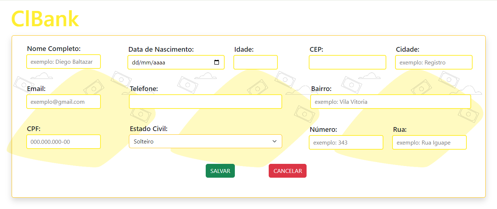

# Sistema-Cadastro
### Descrição do Sistema:
      Sistema de cadastro de dados pessoais, simulação de uma página de banco.
      Função de validação de email, cpf e cep com o intuito de evitar cadastros com dados inválidos.
      Calculo da idade é realizado a partir da data de nascimento inserida pelo usuário.
      Valor da cidade e da UF são preenchidos a partir do cep informado.
      
### Tecnologias:
    - HTML
    - CSS
    - Linguagens: PHP / Javascript
    - Bibliotecas: Bootstrap / Jquery
     

## Exemplo - Execução do projeto:  
### Tela inicial

      </img>      

### Tela de Cadastro

      </img>

